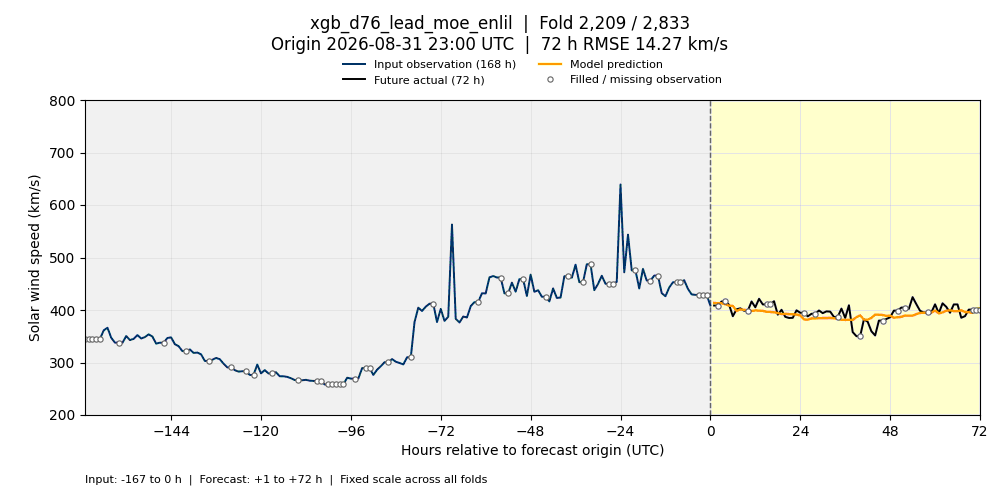

# xgb_d76_lead_moe_enlil — 검증 폴드 GIF

리더보드에 제출된 **E0471 (D148), seed cell 0**의 저장 예측을 표시합니다. 재학습 없이 고정 검증 스냅샷의 2,833개 폴드를 모두 포함하며, 전체 MSE는 **3489.9620220435354**입니다.

제출 설정 SHA256: `6d169ff2b12085f3639b812884cef17324e1b096fb644410e18bd074103d3b54`. 검증 스냅샷: `bcf5d5417d99eaa331ddca40581d48953e09a58e`.

각 프레임은 하나의 검증 폴드입니다. 파란 선은 예측 시작점까지의 최근 **168시간 관측**, 검은 선은 이후 **72시간 실제값**, 주황 선은 모델 예측입니다. 시작점의 세로선과 배경색으로 두 영역을 구분합니다. 빈 원은 원 관측이 누락되어 이전 값으로 채워진 지점입니다. 제목에는 전체 폴드 번호, UTC 시작 시각, 해당 예측 구간의 RMSE가 표시됩니다.

최근 7일은 보기 위한 표시 구간입니다. 모델은 26~28일 전 회귀 입력, ACE plasma/IMF/EPAM, CH, SUVI, DONKI WSA-Enlil 특성도 사용하므로 이 그림이 전체 입력 특성을 나타내지는 않습니다.

첫 예측 시각(`origin + 1h`)의 UTC 월로 구분하며 시간순으로 재생합니다. 모든 GIF는 동일한 Y축 범위를 사용하고, 프레임당 200ms로 반복 재생합니다.

| 월 | 폴드 수 | 한 번 재생 시간 | 파일 |
| --- | ---: | ---: | --- |
| 2026-06 | 720 | 2분 24초 | [6월 GIF](validation_2026-06.gif) |
| 2026-07 | 744 | 약 2분 29초 | [7월 GIF](validation_2026-07.gif) |
| 2026-08 | 744 | 약 2분 29초 | [8월 GIF](validation_2026-08.gif) |
| 2026-09 | 625 | 2분 5초 | [9월 GIF](validation_2026-09.gif) |

## 2026년 6월


## 2026년 7월


## 2026년 8월


## 2026년 9월



## 재현

생성 스크립트: [visualize_enlil_validation.py](../../../scripts/visualize_enlil_validation.py). pandas, numpy, pyarrow, Matplotlib, Pillow가 설치된 Python 환경을 사용합니다. 아래 경로는 생성 시 사용한 로컬 환경 기준이며 각자의 입력 파일 경로로 바꿀 수 있습니다.

```bash
/home/t-lab01/neuralforecast/.venv/bin/python scripts/visualize_enlil_validation.py \
  --predictions /home/t-lab01/sunrun/research/expos/runs/E0471/predictions_official_s0.parquet \
  --folds /home/t-lab01/.cache/huggingface/hub/datasets--tlabtlab--sunrun-lb-store/snapshots/bcf5d5417d99eaa331ddca40581d48953e09a58e/folds.parquet \
  --truth /home/t-lab01/.cache/huggingface/hub/datasets--tlabtlab--sunrun-lb-store/snapshots/bcf5d5417d99eaa331ddca40581d48953e09a58e/truth.parquet \
  --history /home/t-lab01/sunrun/leaderboard/store/ch-v1/ace.parquet \
  --output-dir docs/visualizations/xgb_d76_lead_moe_enlil
```

[manifest.json](manifest.json)에 입력 파일의 SHA256, 모델 식별자, 점수, 프레임 수 및 인코딩 설정을 기록합니다. 검증 정답과 입력 원본 파일은 이 폴더에 업로드하지 않습니다.
